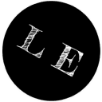

# Portfolio of Leon Ebel

This is the Portfolio of Leon Ebel written in Vue.js with Docker.



## Build Setup

``` bash
# install dependencies
$ npm install

# serve with hot reload at localhost:3000
$ npm run dev

# build for production and launch server
$ npm run build
$ npm run start

# generate static project
$ npm run generate

# Build Vue production environment with docker-compose
docker-compose up -d --build
```

For detailed explanation on how things work, check out [Nuxt.js docs](https://nuxtjs.org).

---

Copyright &copy; 2020 - Leon Ebel
